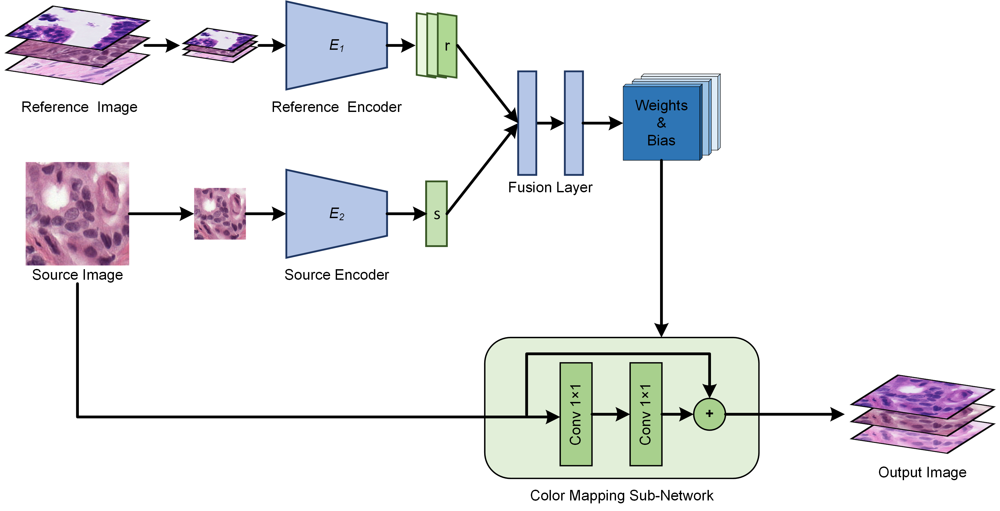

# StainPresetNet

## Abstract

Stain normalization can reduce the color differences affected by various factors, thereby improving the performance of computer-aided diagnostic systems. Conventional stain normalization methods extract mapping relationships from one or several reference images and perform normalization on a pixel-by-pixel manner. Conventional methods can flexibly adjust the style of the output image, but these methods are difficult to extract accurate color mapping relationships from the reference image. Although existing deep learning-based stain normalization methods can accurately extract color mapping relationships from entire datasets, these methods often employ complex deep neural networks, resulting in low computational efficiency and artifact risks. In addition, the normalization direction of existing deep learning-based methods is usually fixed, and when the normalization direction needs to be changed, retraining is needed to learn a new color-mapping relationship. In this paper, we proposed a novel stain normalization method named StainPresetNet, which achieves structure preservation, accurate mapping relationships, multi-domain to multi-domain applicability, and high computational efficiency. StainPresetNet extracts color mapping relationships from entire datasets, normalizes on a pixel-by-pixel manner, and utilizes a preset reference image to guide the normalization direction, meanwhile maintaining high computational efficiency. The results on cytopathology and histopathology datasets demonstrate that StainPresetNet achieves accurate color mapping relationships and can improve the generalization of classifiers on pathology diagnosis tasks.

## Model Architecture



## Install

```bash
pip install requirements.txt
```

## Train

```python
python main.py --name [Your Exp Name] --train_dir_root [Path to data]
```

## Test

```python
python test.py
```

